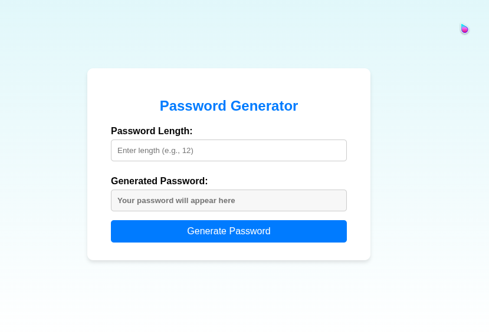
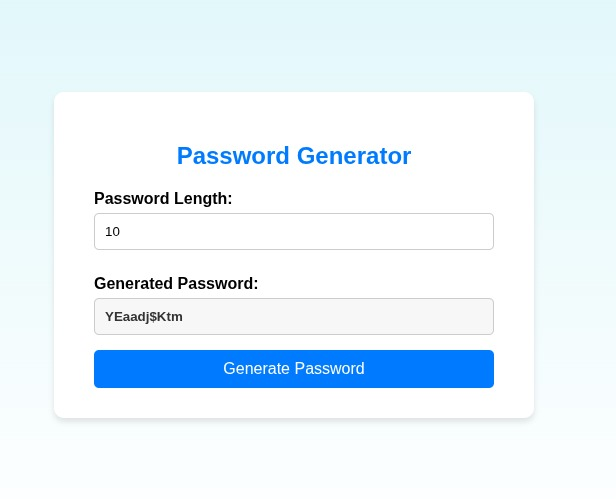

# 🔐 Password Generator

A clean and user-friendly **Password Generator** web app built using **HTML, CSS, and JavaScript**. Instantly generate secure, random passwords of customizable lengths.

---

## 🚀 Features

- ✅ Generate strong, random passwords
- 🔢 Customizable password length
- ✨ Includes uppercase, lowercase, numbers, and symbols
- 📱 Responsive design for all devices
- 💡 User-friendly and intuitive UI

---

## 🖥️ Live Preview

👉 [Click here to view the live demo](https://random-password-tool.vercel.app/) 

---

## 🛠️ Technologies Used

- HTML5
- CSS3 (with responsive styling)
- JavaScript (vanilla)

---

## 📸 Screenshot

 

--- 
## 🔧 How to Use

1. Enter the desired password length in the input field.
2. Click on the **"Generate Password"** button.
3. Your randomly generated password will appear in the output box.


---
 

---

## 📂 Project Structure

```
📁 password-generator
├── index.html
├── style.css
└── script.js
```

---

## 🧠 Idea Behind the Project

This tool was created to help users quickly generate strong and secure passwords for online accounts, ensuring better protection from security threats.

---

## 📃 License

This project is open-source and free to use under the [MIT License](LICENSE).

---

## 🤝 Contribute

Pull requests are welcome. For major changes, please open an issue first to discuss what you'd like to change.

---

## ✍️ Author

Developed by [Mohammad Hasib Hasan](https://github.com/HasibCoderLab)
